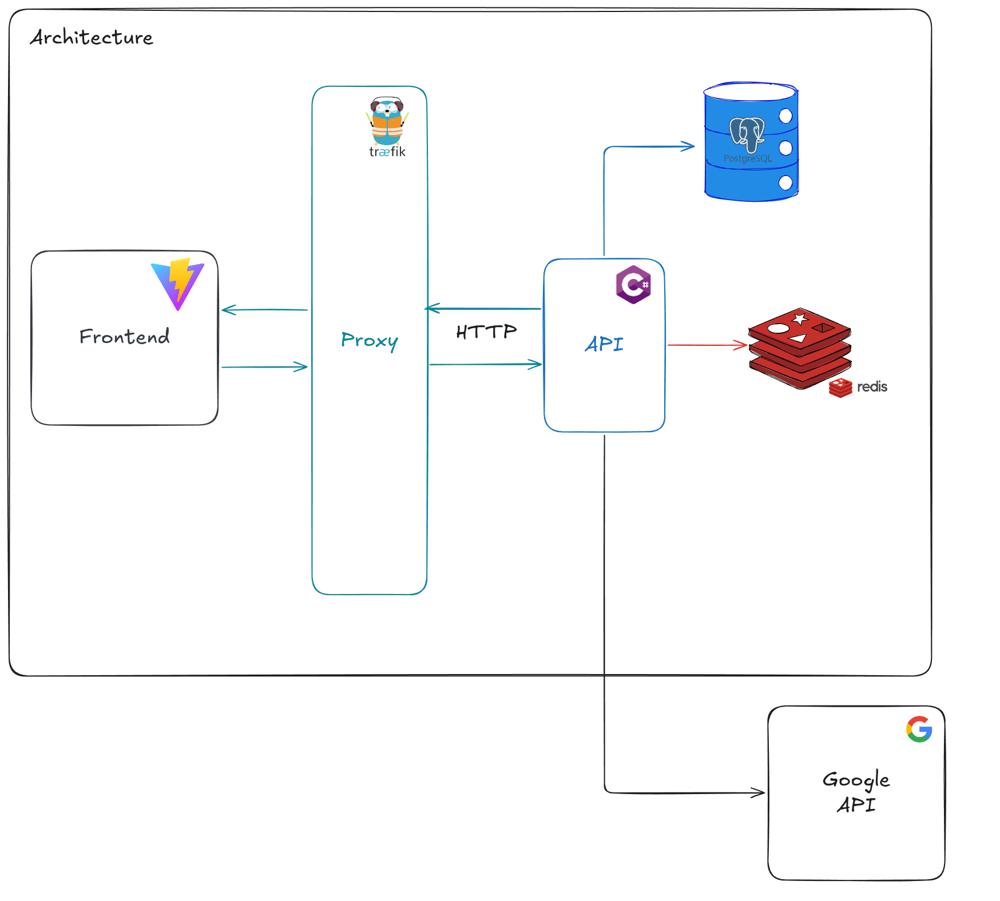
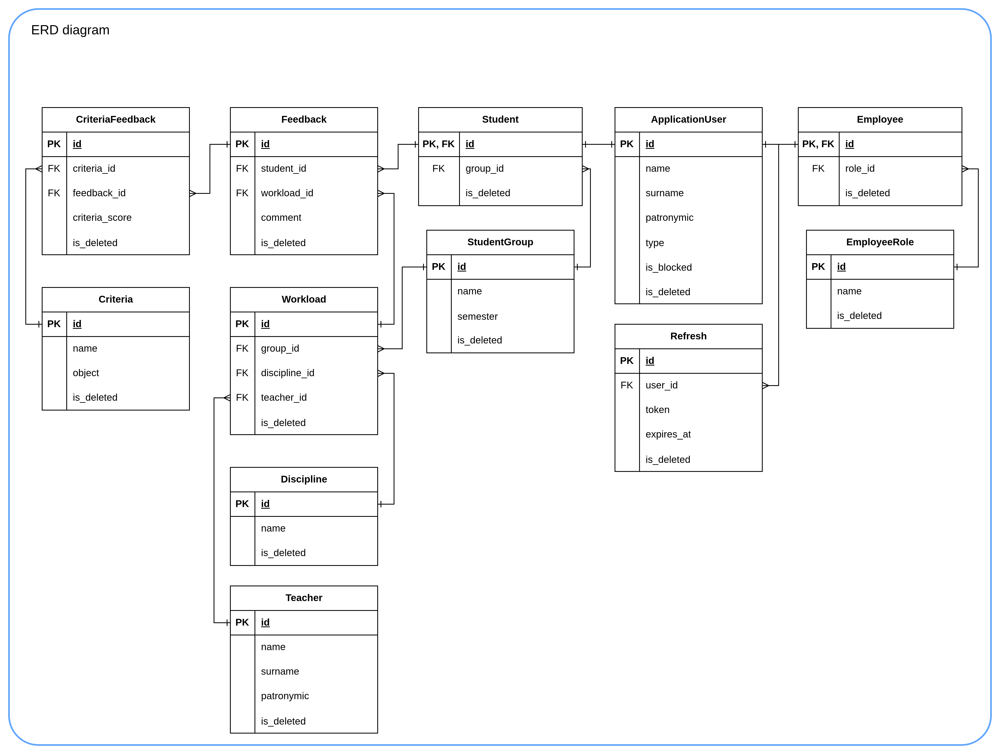

# VSOKO / Backend

REST API for the VSOKO platform. Handles authentication, feedback collection from students, teacher and discipline rating aggregation, report generation, and AI-powered summaries.

This repo is one of three that make up the system:

| Repository | Stack | Role |
| --- | --- | --- |
| **vsoko-backend** (this repo) | C# / ASP.NET Core, MediatR (CQRS), EF Core, PostgreSQL, Redis | REST API: auth, feedback collection, rating aggregation, report generation, AI summaries |
| [**vsoko-frontend**](https://github.com/VSOKO-Project/vsoko-frontend) | React 19, TypeScript, Vite, TanStack Query, Recharts | Web UI for students (feedback) and admins (criteria, ratings, reports) |
| [**vsoko-infra**](https://github.com/VSOKO-Project/vsoko-infra) | Traefik, Docker Compose | Reverse proxy (TLS via Let's Encrypt) |

## Architecture



Monolith built on **Clean Architecture** with 4 layers:

| Layer | Contents |
|---|---|
| **Domain** | Entities, repository interfaces, specifications |
| **Application** | CQRS commands and queries via MediatR, DTOs, validation |
| **Infrastructure** | EF Core + PostgreSQL, Redis cache, JWT, Identity, PDF, AI |
| **Presentation** | ASP.NET Core controllers, middleware, Swagger |

## Stack

- **C# / ASP.NET Core** — Clean Architecture (Domain → Application → Infrastructure → Presentation)
- **MediatR** — CQRS, pipeline behaviors (validation, transaction, logging)
- **Entity Framework Core + PostgreSQL** — transactional data: users, workloads, feedback, criteria, tokens
- **ASP.NET Core Identity + JWT Bearer** — authentication and custom RBAC authorization
- **HybridCache + Redis** — two-level caching (L1 in-memory + L2 Redis) for high-load read endpoints
- **FluentValidation** — request validation in the MediatR pipeline
- **Riok.Mapperly** — compile-time source-generated mapping
- **QuestPDF** — report generation
- **Semantic Kernel + Google AI** — AI-generated summaries for teachers and disciplines
- **Serilog** — structured JSON logging

## Database Schema



| Table | Purpose |
|---|---|
| `ApplicationUser` | System users (Identity): employees and students |
| `Employee` / `EmployeeRole` | Employees with roles (RBAC) |
| `Student` / `StudentGroup` | Students and academic groups |
| `Teacher` | Teachers |
| `Discipline` | Academic disciplines |
| `Workload` | Junction of teacher, discipline, and group |
| `Feedback` | Student review for a specific workload |
| `Criteria` / `CriteriaFeedback` | Evaluation criteria and per-criteria scores |
| `Refresh` | Refresh tokens for JWT authentication |

## Auth & RBAC

Authentication via JWT + Refresh tokens. Authorization is implemented as a custom RBAC model:
- roles and permissions are stored in the database (`EmployeeRole`)
- access checks are enforced at the Application layer (MediatR pipeline), not just via controller attributes
- security-related business logic is isolated from the Presentation layer

## MediatR Pipeline

Every command and query passes through three behaviors in order:

```
Request
  → LoggingBehavior      (structured request/response logging)
  → ValidationBehavior   (FluentValidation, throws on failure)
  → TransactionBehavior  (wraps commands in a DB transaction)
  → Handler
```

## Endpoints

**Auth** `POST /api/security/{Login, Refresh, LogOut}`

**Workload**
| Method | Path | Auth | Description |
|---|---|---|---|
| `GET` | `/api/workload` | any | List workloads (paged) |
| `GET` | `/api/workload/{id}` | any | Get workload by id |

**Feedback**
| Method | Path | Auth | Description |
|---|---|---|---|
| `POST` | `/api/feedback` | any | Submit feedback |
| `GET` | `/api/feedback` | any | List feedback (paged) |
| `GET` | `/api/feedback/{id}` | any | Get feedback by id |
| `PUT` | `/api/feedback/{id}` | any | Update feedback |
| `DELETE` | `/api/feedback/{id}` | any | Delete feedback |

**Criteria**
| Method | Path | Auth | Description |
|---|---|---|---|
| `POST` | `/api/criteria` | Admin | Create criteria |
| `PUT` | `/api/criteria/{id}` | Admin | Update criteria |
| `DELETE` | `/api/criteria/{id}` | Admin | Delete criteria |
| `GET` | `/api/criteria` | any | List all criteria |
| `GET` | `/api/criteria/{id}` | any | Get criteria by id |

**Teachers**
| Method | Path | Auth | Description |
|---|---|---|---|
| `GET` | `/api/teachers` | Admin | List teachers (paged) |
| `GET` | `/api/teachers/rating` | Admin | Teacher rating (paged) |

**Disciplines**
| Method | Path | Auth | Description |
|---|---|---|---|
| `GET` | `/api/disciplines` | Admin | List disciplines (paged) |
| `GET` | `/api/disciplines/rating` | Admin | Discipline rating (paged) |

**Summaries**
| Method | Path | Auth | Description |
|---|---|---|---|
| `GET` | `/api/summaries/teacher/{id}` | Admin | AI summary for a teacher |
| `GET` | `/api/summaries/discipline/{id}` | Admin | AI summary for a discipline |

**Health** `GET /health/live`

## Caching

Two-level caching on high-load read endpoints via `ICacheService`:

- **L1** — `HybridCache` (in-memory, per-instance)
- **L2** — Redis (distributed, shared across instances)

Cache invalidation uses tag-based eviction — commands invalidate cache by tag, not by individual key.

Load test results (k6, 200 VU):

| Metric | Before | After |
|---|---|---|
| p95 latency | 33 ms | 13 ms |
| Average response time | 13 ms | 5 ms |

## Running

```bash
cp .env.example .env
# fill in POSTGRES_*, REDIS_*, JWT secret, Google AI key

docker compose up
```

The API runs on port **8000** (mapped to container port 8080) and exposes Swagger UI at `/swagger`.