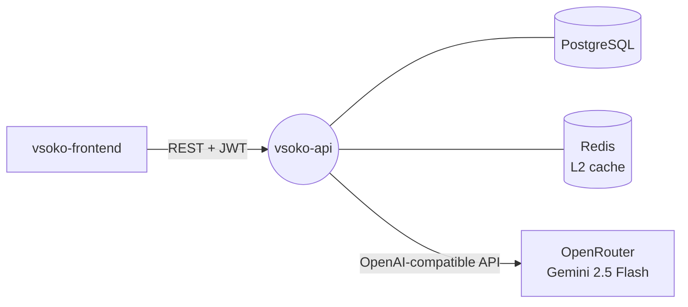
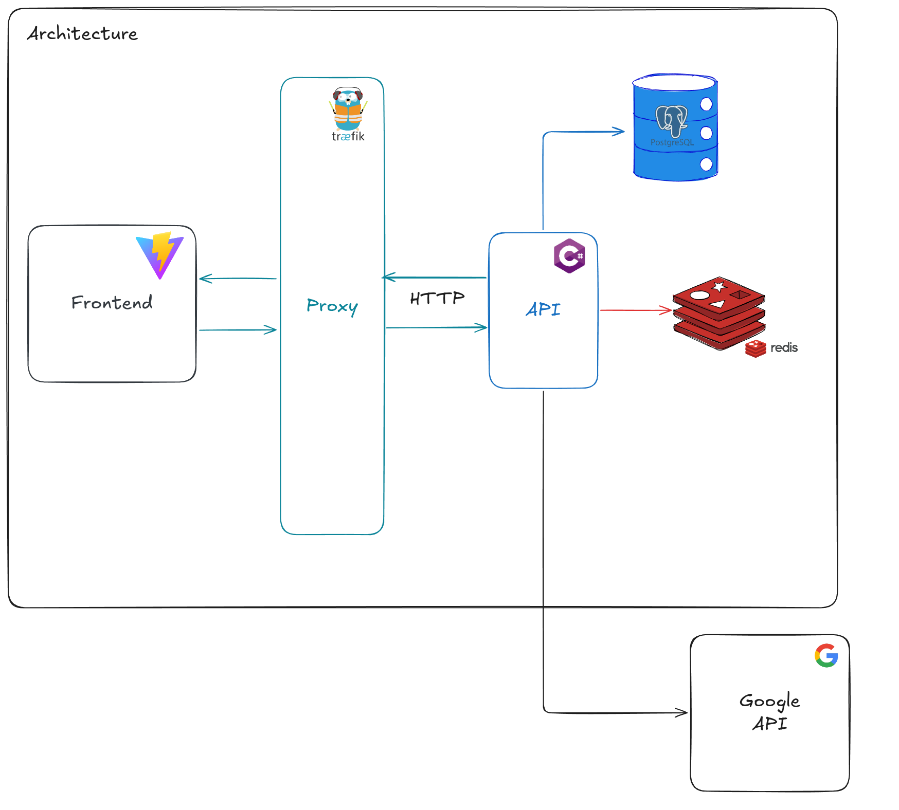
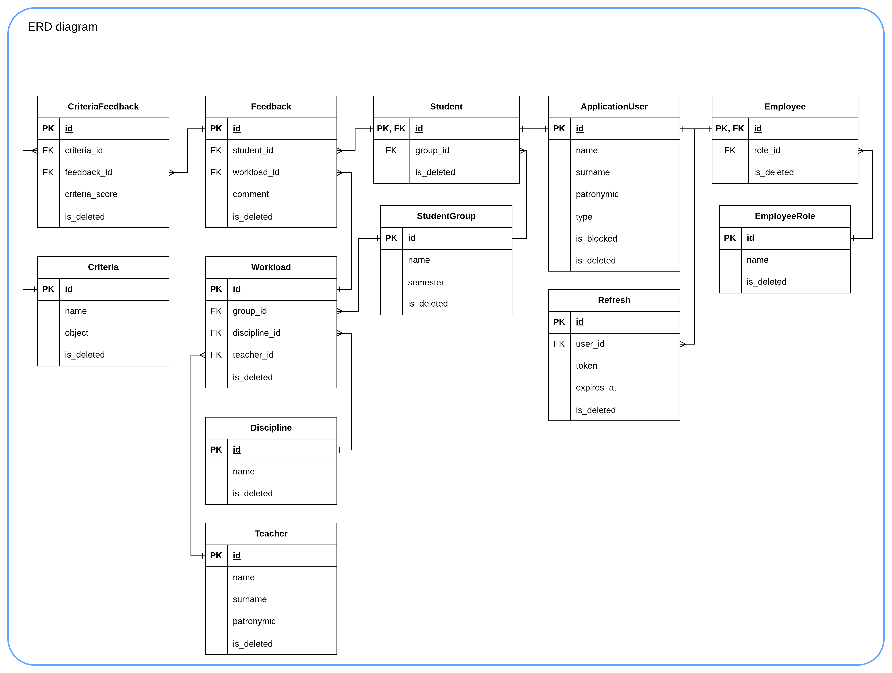

# VSOKO API

REST API: sign-in, feedback, teacher and course ratings, PDF reports, AI summaries.

Stack: C#, ASP.NET Core, PostgreSQL 16, Redis, MediatR, QuestPDF, Semantic Kernel.

## What it does

The only backend in VSOKO. Students sign in and rate each of their workloads
(*teacher × course × group*) against criteria set by an admin. Admins manage the
criteria, see teacher and course ratings, export a PDF report, and ask an LLM to
summarize the written feedback.


```mermaid
flowchart LR
  FE[vsoko-frontend] -->|REST + JWT| S((vsoko-api))
  S --- PG[(PostgreSQL)]
  S --- R[(Redis<br>L2 cache)]
  S -->|OpenAI-compatible API| LLM[OpenRouter<br>Gemini 2.5 Flash]
```

## Features

- **Feedback** — students submit, edit, and delete feedback on a workload, with a score for every criterion.
- **Ratings** — paged teacher and course ratings built from the criteria scores.
- **PDF report** — summary indexes plus teacher and course rankings, generated with QuestPDF.
- **AI summaries** — Semantic Kernel condenses written feedback on a teacher or course. Works with any OpenAI-compatible endpoint, with an optional HTTP proxy.
- **Two-level cache** — `HybridCache` (in-memory + Redis) with tag-based invalidation. Under k6 at 200 users, p95 dropped from 33 to 13 ms and the average from 13 to 5 ms.
- **Roster import** — CLI tools that import students and workloads from CSV; safe to re-run.

## Architecture



A monolith built on **Clean Architecture**:

| Layer | Contents |
| --- | --- |
| **Domain** | entities, enums |
| **Application** | MediatR commands and queries, DTOs, validators, pipeline behaviors |
| **Infrastructure** | EF Core + PostgreSQL, Identity + JWT, HybridCache + Redis, QuestPDF, Semantic Kernel |
| **Presentation** | controllers, filters, Swagger, health checks, Serilog |

### MediatR pipeline

Every command and query goes through three behaviors:

```text
Request → LoggingBehavior → ValidationBehavior (FluentValidation) → TransactionBehavior → Handler
```

### Auth and roles

- JWT access tokens plus refresh tokens stored in the `Refresh` table; logout revokes them.
- ASP.NET Core Identity users with roles; admin endpoints use `[Authorize(Roles = "Admin")]`.
- Imported accounts get a temporary password. Until it is changed, a global filter blocks every endpoint except password change.

## Endpoints

Swagger UI is at `/swagger` in Development. Health checks: `GET /health/live`, `GET /health/ready`.

| Area | Endpoints | Access |
| --- | --- | --- |
| Security | `POST /api/security/Login` · `Refresh` · `LogOut` · `ChangePassword` | public / signed in |
| Workloads | `GET /api/workload` · `GET /api/workload/{id}` | signed in |
| Feedback | `POST` / `GET /api/feedback` · `GET` / `PUT` / `DELETE /api/feedback/{id}` | signed in |
| Criteria | `GET /api/criteria` · `GET /api/criteria/{id}` | signed in |
| Criteria | `POST /api/criteria` · `PUT` / `DELETE /api/criteria/{id}` | Admin |
| Teachers | `GET /api/teachers` · `GET /api/teachers/rating` | Admin |
| Courses | `GET /api/disciplines` · `GET /api/disciplines/rating` | Admin |
| Summaries | `GET /api/summaries/teacher/{id}` · `GET /api/summaries/discipline/{id}` | Admin |
| Report | `POST /api/report` → PDF | Admin |

## Data model



| Entity | What it holds |
| --- | --- |
| `ApplicationUser` | Identity account of a student or staff member |
| `Employee` / `EmployeeRole` | staff and their roles |
| `Student` / `StudentGroup` | students and their groups |
| `Teacher` · `Discipline` | teachers and courses |
| `Workload` | teacher × course × group |
| `Feedback` | a student's review of a workload |
| `Criteria` / `CriteriaFeedback` | criteria and the score for each one |
| `Refresh` | refresh tokens |

## Quick start

You need the external Docker network `web_network` and the Traefik proxy from `vsoko-infra`.

```bash
cp .env.example .env
docker compose up -d    # postgres, redis, api → http://localhost:8000
```

Migrations don't run on startup. Apply them once the database is up:

```bash
dotnet ef database update --project src/Infrastructure --startup-project src/Presentation
```

For local development, run only PostgreSQL and Redis in Docker:

```bash
docker compose -f docker-compose.dev.yml up -d
dotnet run --project src/Presentation
```

To import a roster:

```bash
# CSV: GroupName,Semester,Surname,Name,Patronymic,StudentNumber — temp password Vsoko{StudentNumber}
IMPORT_DB_CONNECTION="Host=…;Database=…;Username=…;Password=…" \
IMPORT_ROSTER_CSV=students.csv dotnet run --project src/Tools/ImportStudents

# CSV: TeacherFio,Discipline,GroupName
IMPORT_DB_CONNECTION="…" \
IMPORT_WORKLOADS_CSV=workloads.csv dotnet run --project src/Tools/ImportWorkloads
```

## Structure

```text
vsoko-api/
├── docs/assets/            # architecture and ERD diagrams
└── src/
    ├── Domain/             # entities, enums
    ├── Application/        # Features/{Security, Workload, Feedback, Criteria, Teachers, Disciplines, Summaries, Report}, behaviors
    ├── Infrastructure/     # DataManager (EF Core, migrations, seeders), SecurityManager, CachingManager, FileManager (PDF), AIManager
    ├── Presentation/       # controllers, filters, Program.cs
    └── Tools/              # ImportStudents, ImportWorkloads
```
