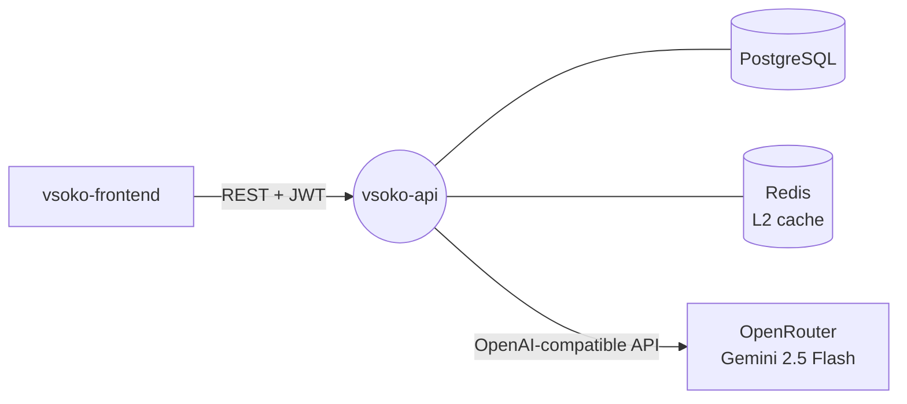

<div align="center">

<a href="https://gitlab.com/vsoko"></a>

# ⚙️ vsoko-api

### REST API: authentication, feedback collection, teacher and discipline ratings, PDF reports, AI summaries

[](https://gitlab.com/vsoko/vsoko-api/-/pipelines)


<sub>Part of <a href="https://gitlab.com/vsoko"><b>VSOKO</b></a> — an education quality assessment platform running in production at a university</sub>

</div>

---

## Role in the system

The single backend of VSOKO. Students sign in and rate each of their workloads
(*teacher × discipline × group*) against admin-defined criteria. Administrators manage the criteria,
read teacher and discipline ratings, export a PDF report and request LLM-generated summaries of the
written feedback. Read-heavy endpoints are served through a two-level cache.


```mermaid
flowchart LR
  FE[vsoko-frontend] -->|REST + JWT| S((vsoko-api))
  S --- PG[(PostgreSQL)]
  S --- R[(Redis<br>L2 cache)]
  S -->|OpenAI-compatible API| LLM[OpenRouter<br>Gemini 2.5 Flash]
```

## Features

- **Feedback collection** — students submit, edit and delete feedback per workload, scored on every criterion.
- **Ratings** — paged teacher and discipline ratings aggregated from criteria scores.
- **PDF report** — an analytical report with summary indexes and teacher and discipline rankings, generated with QuestPDF.
- **AI summaries** — Semantic Kernel condenses the written feedback on a teacher or discipline; works with any OpenAI-compatible endpoint, optional HTTP proxy.
- **Two-level cache** — `HybridCache` (L1 in-memory, L2 Redis) with tag-based invalidation; k6 at 200 VU: p95 **33 → 13 ms**, average **13 → 5 ms**.
- **Roster import** — idempotent CLI tools that import students and workloads from CSV.

## Architecture


Monolith on **Clean Architecture**:

| Layer | Contents |
| --- | --- |
| **Domain** | entities, enums |
| **Application** | CQRS commands and queries (MediatR), DTOs, validators, pipeline behaviors |
| **Infrastructure** | EF Core + PostgreSQL, Identity + JWT, HybridCache + Redis, QuestPDF, Semantic Kernel |
| **Presentation** | controllers, filters, Swagger, health checks, Serilog |

### MediatR pipeline

Every command and query passes through three behaviors:

```text
Request → LoggingBehavior → ValidationBehavior (FluentValidation) → TransactionBehavior → Handler
```

### Auth & RBAC

- JWT access tokens plus refresh tokens stored in the `Refresh` table; logout revokes them.
- ASP.NET Core Identity users with roles; admin-only endpoints are guarded by `[Authorize(Roles = "Admin")]`.
- Imported accounts get a temporary password and `MustChangePassword = true`. A global filter blocks every endpoint except password change until it is reset.

## Endpoints

Swagger UI: `/swagger` (Development). Health checks: `GET /health/live`, `GET /health/ready`.

| Area | Endpoints | Access |
| --- | --- | --- |
| Security | `POST /api/security/Login` · `Refresh` · `LogOut` · `ChangePassword` | public / authorized |
| Workloads | `GET /api/workload` · `GET /api/workload/{id}` | authorized |
| Feedback | `POST` / `GET /api/feedback` · `GET` / `PUT` / `DELETE /api/feedback/{id}` | authorized |
| Criteria | `GET /api/criteria` · `GET /api/criteria/{id}` | authorized |
| Criteria | `POST /api/criteria` · `PUT` / `DELETE /api/criteria/{id}` | Admin |
| Teachers | `GET /api/teachers` · `GET /api/teachers/rating` | Admin |
| Disciplines | `GET /api/disciplines` · `GET /api/disciplines/rating` | Admin |
| Summaries | `GET /api/summaries/teacher/{id}` · `GET /api/summaries/discipline/{id}` | Admin |
| Report | `POST /api/report` → PDF | Admin |

## Data model


| Entity | Purpose |
| --- | --- |
| `ApplicationUser` | Identity account of a student or an employee |
| `Employee` / `EmployeeRole` | employees and their roles |
| `Student` / `StudentGroup` | students and academic groups |
| `Teacher` · `Discipline` | teachers and disciplines |
| `Workload` | teacher × discipline × group |
| `Feedback` | a student's review of a workload |
| `Criteria` / `CriteriaFeedback` | evaluation criteria and per-criterion scores |
| `Refresh` | refresh tokens |

## Quick start

Needs the external Docker network `web_network` and the Traefik proxy from
[vsoko-infra](https://gitlab.com/vsoko/vsoko-infra).

```bash
cp .env.example .env    # POSTGRES_*, REDIS_*, Jwt__SecretKey, Cors__AllowedOrigins, AI__*
docker compose up -d    # postgres, redis, api → http://localhost:8000, https://vsoko-api.semao0.ru
```

Migrations are not applied on startup. Run them once after the database is up:

```bash
dotnet ef database update --project src/Infrastructure --startup-project src/Presentation
```

**Local development** — only PostgreSQL and Redis in Docker:

```bash
docker compose -f docker-compose.dev.yml up -d
dotnet run --project src/Presentation
```

**Importing a roster:**

```bash
# CSV: GroupName,Semester,Surname,Name,Patronymic,StudentNumber — temp password Vsoko{StudentNumber}
IMPORT_DB_CONNECTION="Host=…;Database=…;Username=…;Password=…" \
IMPORT_ROSTER_CSV=students.csv dotnet run --project src/Tools/ImportStudents

# CSV: TeacherFio,Discipline,GroupName
IMPORT_DB_CONNECTION="…" \
IMPORT_WORKLOADS_CSV=workloads.csv dotnet run --project src/Tools/ImportWorkloads
```

## Structure

```text
vsoko-api/
├── docs/assets/            # architecture and ERD diagrams
└── src/
    ├── Domain/             # entities, enums
    ├── Application/        # Features/{Security, Workload, Feedback, Criteria, Teachers, Disciplines, Summaries, Report}, behaviors
    ├── Infrastructure/     # DataManager (EF Core, migrations, seeders), SecurityManager, CachingManager, FileManager (PDF), AIManager
    ├── Presentation/       # controllers, filters, Program.cs
    └── Tools/              # ImportStudents, ImportWorkloads
```
